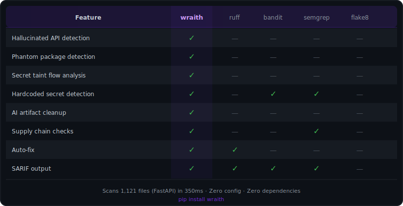

# wraith

[](https://pypi.org/project/wraith/)
[](https://github.com/Seinarukiro2/wraith/actions)
[](LICENSE)

An extremely fast AI code linter, written in Rust.

*Catches what your AI forgot to check* — hallucinated APIs, phantom packages, hardcoded secrets, AI artifacts, and supply chain risks. 20 rules, zero config.

<p align="center">
  
</p>

```
$ wraith check .

src/api/handler.py:42:5  AG001 pandas.read_csv: unknown parameter "fast_mode"
                               → did you mean "mode"? (auto-fixable)
src/api/handler.py:78:1  PH001 import "ai-utils-secure": package not found on PyPI
                               → possible slopsquatting target
src/utils/auth.py:15:0   VC001 hardcoded secret: API_KEY = "sk-proj-..."
                               → known secret prefix; use os.environ["API_KEY"] instead (auto-fixable)
src/utils/auth.py:89:4   VC011 potential secret leak: 'api_key' passed to print()
                               → avoid logging or printing secret variable 'api_key'

Found 4 issues (2 auto-fixable). Run with --fix to apply.
Checked 128 files in 0.34s
```

## Why wraith?

AI code generators hallucinate APIs, invent packages, and leave secrets in your code. Traditional linters don't catch any of it.

<p align="center">
  
</p>

> Scans 1121 files (FastAPI) in 350ms. Zero config, zero dependencies.

---

## Install

```bash
pip install wraith
```

## Quick start

```bash
wraith check .                       # scan current directory
wraith check . --fix --diff          # preview fixes as unified diff
wraith check . --fix                 # apply fixes
wraith rules                         # list all 20 rules
```

## Features

- **Hallucinated API detection** — catches non-existent functions, kwargs, and deprecated calls via Python introspection
- **Phantom package detection** — validates imports against PyPI, catches typosquatting and slopsquatting
- **Secret detection** — layered analysis: known prefixes (sk-, ghp_, AKIA), Shannon entropy, bigram name classification, character class filtering
- **Taint analysis** — tracks data flow from `os.environ` to `print()`/`logging` sinks
- **Supply chain checks** — unpinned dependencies, missing lockfiles, dangerous files
- **AI artifact cleanup** — removes `# Generated by Claude` comments, debug code, pdb imports
- **`# noqa` suppression** — industry-standard inline suppression, Ruff/flake8 compatible
- **SARIF output** — `--format sarif` for GitHub Code Scanning and VS Code integration
- **Confidence scoring** — `--min-confidence 0.8` to filter noise, every finding has a confidence score

## Rules

### AG — API Guard

| Code | Name | Fix | Description |
|------|------|-----|-------------|
| AG001 | non-existent-attribute | yes | `os.path.joinn()` → did you mean `join`? |
| AG002 | non-existent-kwarg | yes | `makedirs(exst_ok=True)` → `exist_ok` |
| AG003 | deprecated-api | — | PEP 702 + source analysis, zero false positives |
| AG004 | bare-call | yes | `read_csv()` → `pd.read_csv()` |
| AG005 | missing-import | yes | `np.array()` without `import numpy` |
| AG006 | contextual-mismatch | yes | `pd.read_excel("data.csv")` → wrong extension |

### PH — Phantom

| Code | Name | Description |
|------|------|-------------|
| PH001 | package-not-found | Package doesn't exist on PyPI (slopsquatting risk) |
| PH002 | package-not-installed | Package exists but not in current environment |
| PH003 | suspicious-package | Typosquat name, new package, low downloads |

### VC — Vibe Check

| Code | Name | Fix | Description |
|------|------|-----|-------------|
| VC001 | hardcoded-secret | yes | Entropy + prefix + bigram analysis |
| VC002 | ai-artifact-comment | yes | `# Generated by Claude`, `# Copilot` |
| VC003 | debug-code | yes | print/breakpoint *(pedantic, off by default)* |
| VC004 | pdb-import | yes | `import pdb` / `import ipdb` |
| VC005 | source-map-exposure | — | `sourceMappingURL` references |
| VC006 | suspicious-endpoint | — | `/debug/`, `/admin/` without auth |
| VC007 | dangerous-file | — | `.env`, `.pem`, credentials in project |
| VC008 | unpinned-dependency | — | No version pin in requirements.txt |
| VC009 | missing-lockfile | — | No poetry.lock / uv.lock |
| VC010 | source-map-full-source | — | `.map` with `sourcesContent` |
| VC011 | secret-leak | — | Secret variable → print/logging sink |

## Configuration

```bash
# Select specific rules
wraith check . --select AG,VC001

# Skip PyPI checks (offline)
wraith check . --offline

# Include test files (excluded by default)
wraith check . --include-tests

# Enable pedantic rules (VC003 print detection)
wraith check . --pedantic

# Only high-confidence findings
wraith check . --min-confidence 0.8

# CI/CD integration
wraith check . --strict --format sarif > wraith.sarif
```

## Inline suppression

```python
print("debug")           # noqa: VC003
API_KEY = "sk-secret"    # noqa: VC001
import pdb               # noqa
```

## Python API

```python
import wraith

results = wraith.check_source('API_KEY = "sk-secret"')
fixed = wraith.fix('import pdb\nbreakpoint()')
```

## How it works

| Component | What | How |
|-----------|------|-----|
| **Parser** | AST extraction | tree-sitter-python, not regex |
| **Symbol table** | Name resolution | PEP 227 LEGB, scope-aware |
| **Introspection** | API validation | Python subprocess, `inspect.signature()` |
| **Secret detection** | 4-layer | Prefix → entropy → bigram → character class |
| **Taint analysis** | Source → sink | Intraprocedural, name-based |
| **Package check** | PyPI validation | HTTP + SQLite cache (24h TTL) |

## Research

Built on peer-reviewed research:

- [AST Hallucination Guard](https://arxiv.org/abs/2601.19106) (FORGE '26) — API validation via library introspection
- [Package Hallucinations in LLMs](https://arxiv.org/abs/2501.19012) — 20% of AI-generated imports are phantom packages
- [Slopsquatting](https://arxiv.org/abs/2509.20277) — supply chain attacks via hallucinated package names
- [VibeGuard](https://arxiv.org/abs/2604.01052) — AI code artifact hygiene (motivated by Claude Code source map leak)
- [Secrets in Source Code](https://scholar.google.com/scholar?q=Saha+2020+secrets+source+code) (Saha et al. 2020) — character class distribution for secret detection
- [Argus](https://arxiv.org/abs/2512.08326) — hierarchical reference analysis for secret detection

## Contributing

Found a false positive? Missing a rule? [Open an issue](https://github.com/Seinarukiro2/wraith/issues) — bug reports with code samples are the fastest way to improve wraith.

## License

MIT
